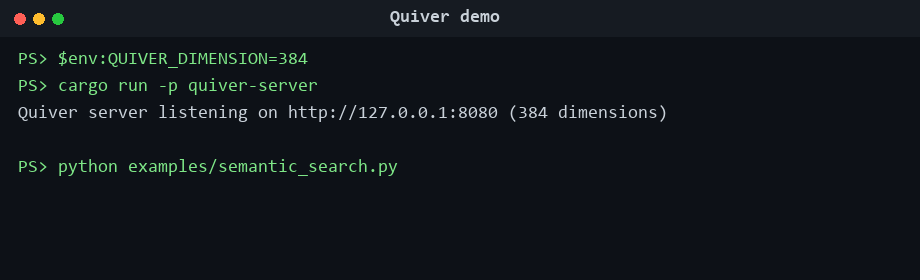

# Quiver

[](https://github.com/uppalasrichaitanya/Quiver/actions/workflows/ci.yml)

Quiver is a portfolio-grade, single-node vector database built from scratch in Rust. Its purpose is to demonstrate systems-engineering work—binary formats, mmap storage, write-ahead logging, crash recovery, graph indexing, SIMD, fuzzing, and honest measurement—in a repository that can be inspected and tested.

Quiver is **not production software** and is not intended to compete with Qdrant, Pinecone, FAISS, Milvus, or hnswlib. It currently lacks the operational hardening, feature breadth, and benchmark evidence required for those comparisons. The goal is correctness rigor and a transparent account of the remaining gap, not a claim that a small from-scratch implementation wins.

## Current status

Implemented in `quiver-core`:

- Versioned mmap vector storage with a 64-byte header; legacy v1 and explicit-ID v2 files are readable.
- CRC32-checksummed write-ahead log with idempotent insert replay, durable deletion, and incomplete-tail truncation.
- Crash-safe live-only compaction using durable replacement files, a swap journal, and recovery from interruption during the swap.
- Bounds-checked file parsing for headers and records, plus a dedicated libFuzzer target.
- Scalar and hand-written x86_64 AVX2/FMA kernels for L2, dot product, and cosine distance, with runtime dispatch and scalar fallback.
- Exact brute-force search and multi-layer HNSW insert/search/delete.
- Tests comparing HNSW recall with brute-force ground truth and real subprocess-kill tests for ordinary WAL recovery and compaction recovery.

The workspace includes an Axum server with insert, search, and delete endpoints, plus a PyO3 local `Index` API for the same core operations.

## Known limitations

- HNSW graph topology is not persisted; reopening reconstructs the graph from stored live vectors.
- The HNSW API is single-threaded. Mutation safety comes from Rust's `&mut self`; there is no operational single-writer/multi-reader wrapper yet.
- SQ8 and IVF-PQ are planned but not implemented.
- Benchmark evidence, including reproducible SIFT1M comparisons and scalar/SIMD Criterion results, is documented in `benchmarks/`. A sampling flamegraph remains unavailable after the documented `samply` install attempt.
- The crates have not yet been released to crates.io or PyPI.

## Build and test

Install a current stable Rust toolchain, then run:

```bash
cargo test --workspace
cargo clippy --workspace --all-targets -- -D warnings
cargo fmt --all -- --check
```

The default workspace test run includes hard-kill subprocess recovery tests. On Unix, `Child::kill` sends SIGKILL; on Windows it uses `TerminateProcess`.

To execute the file parser fuzz target on Linux:

```bash
rustup toolchain install nightly
cargo install cargo-fuzz --locked
cd fuzz
cargo +nightly fuzz run file_format -- -max_total_time=60
```

CI runs that target for 60 seconds on a Linux runner on every push and pull request.

## Benchmarks

Run the currently available Criterion microbenchmarks with:

```bash
cargo bench -p quiver-core
```

These cover distance kernels and local brute-force/HNSW operations. They are development harnesses, not the final comparative benchmark suite, and no performance claim should be inferred from their presence. Phase 6 will profile the scalar path first and then commit reproducible, same-hardware comparisons with FAISS and hnswlib.

A reproducible single-threaded SIFT1M comparison is available in
[`benchmarks/`](benchmarks/README.md). It includes raw JSON for the complete
Quiver/FAISS/hnswlib configuration sweep and documents the measured
quality/cost trade-offs.

## Semantic-search demo

Run semantic search over a small real-text corpus through the HTTP API:

```powershell
$env:QUIVER_DIMENSION=384
cargo run -p quiver-server
# In another terminal:
python examples/semantic_search.py
```

The server exposes `POST /vectors`, `POST /search`, and
`DELETE /vectors/{id}`. A local native Python API is also available through
[`quiver-py`](quiver-py/README.md).



## Workspace layout

```text
quiver-core/    mmap storage, WAL, distance kernels, brute-force, HNSW
quiver-server/  minimal HTTP insert/search/delete API
quiver-py/      PyO3 local Index API
fuzz/           dedicated file-format libFuzzer package and seed corpus
```

Quiver is dual-licensed under MIT or Apache-2.0.
