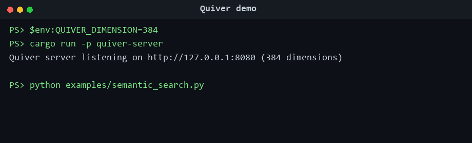

# Quiver

[](https://github.com/uppalasrichaitanya/Quiver/actions/workflows/ci.yml)


**A single-node vector database built from scratch in Rust** — mmap storage, a
checksummed write-ahead log, crash recovery, HNSW / SQ8 / IVF-PQ indexes,
hand-written AVX2 kernels, filtered search, an HTTP server, and Python bindings.

Quiver is a systems-engineering portfolio project, not production software. The
goal is correctness you can inspect and measurements you can reproduce — every
benchmark number below links to raw JSON, including the ones where Quiver loses.



## Highlights

| | |
|---|---|
| **Search quality** | HNSW with diversified neighbor selection: Recall@10 **0.9961** on SIFT1M at M=32 / ef=100 (FAISS 0.9922, hnswlib 0.9920) |
| **Search speed** | **2,680 QPS**, p50 **0.38 ms** single-threaded on SIFT1M — on par with FAISS and hnswlib |
| **Durability** | CRC32 WAL with group commit, crash-safe compaction and WAL checkpointing (journaled multi-file renames), header checksums, subprocess **hard-kill tests** at every failpoint |
| **Compression** | SQ8 (4x) and IVF-PQ (16x codes, 0.9952 recall with exact rerank), both with CRC-protected snapshots |
| **Filtered search** | `Eq` / `And` / `Or` / `In` / `Range` predicates over durable, mutable metadata; exact posting-list scan for selective filters, filter-aware graph traversal otherwise |
| **Hardening** | Bounds-checked parsers, a libFuzzer target run in CI, NaN/overflow-safe distance kernels, input limits on every public endpoint |

## Quick start

```bash
cargo test -p quiver-core -p quiver-server   # 235 unit + 1 cross-validation + 17 server integration tests
cargo run --release -p quiver-server          # listens on 127.0.0.1:8080, 384-d cosine index
```

```bash
# Insert a vector with metadata
curl -X POST localhost:8080/vectors -H 'content-type: application/json' \
  -d '{"vector": [0.1, 0.2, ...], "metadata": {"category": "science", "year": 2024}}'

# k-NN search, optionally filtered
curl -X POST localhost:8080/search -H 'content-type: application/json' \
  -d '{"vector": [0.1, 0.2, ...], "k": 5,
       "filter": {"And": [{"Eq": {"key": "category", "value": "science"}},
                          {"Range": {"key": "year", "min": 2020, "max": 2025}}]}}'
```

Or use it as an embedded library from Python ([`quiver-py`](quiver-py/README.md)):

```python
from quiver_db import Index
index = Index("docs.qvdb", "docs.wal", 384)   # Index.open(...) reopens an existing one
index.insert(embedding, metadata={"category": "science"})
hits = index.search(query, k=5, filter={"Eq": {"key": "category", "value": "science"}})
```

A complete semantic-search demo over a real text corpus lives in
[`examples/semantic_search.py`](examples/semantic_search.py).

## Benchmarks

Single-threaded SIFT1M (1M × 128-d, 10k queries, L2) on an i7-12650H, same
host and harness for every engine. Full methodology, sweeps, and raw JSON:
[`benchmarks/README.md`](benchmarks/README.md).

| Index | Parameters | Recall@10 | QPS | Build |
|---|---|---:|---:|---:|
| **Quiver HNSW** | M=32, efC=200, ef=100 | **0.9961** | 2,680 | 1,145 s |
| FAISS HNSW | M=32, efC=200, ef=100 | 0.9922 | 2,336 | 560 s |
| hnswlib | M=32, efC=200, ef=100 | 0.9920 | 2,832 | 566 s |
| **Quiver IVF-PQ** + rerank | nlist=1024, m=32, nprobe=64 | 0.9952 | 1,058 | 95 s |
| **Quiver SQ8** flat | exhaustive | 0.9889 | 15 | — |

The honest gap: **build is ~2x slower** than FAISS/hnswlib, because Quiver
fsyncs a WAL during the build while they build in memory and serialize once.

Filtered search on the same corpus (graph traversal path, ef=100): ~2,124 QPS
at 50% selectivity and ~195 QPS at 1%, recall ≥ 0.9837 throughout. Selective
`Eq` filters (≤ 32,768 matches) take an exact scan with recall 1.0.

## HTTP API

| Method | Path | Purpose |
|---|---|---|
| `GET` | `/health`, `/metrics` | Liveness; index size, dimension, metric, graph depth |
| `POST` | `/vectors` | Insert `{vector, metadata?}` → `{id}` |
| `DELETE` | `/vectors/{id}` | Durable tombstone delete |
| `PUT` / `DELETE` | `/vectors/{id}/metadata` | Replace / clear a vector's metadata |
| `POST` | `/search`, `/search/batch` | HNSW k-NN with optional `filter`, `ef_search` |
| `POST` | `/sq8/search`, `/ivfpq/search` | Search pre-built quantized snapshots (read-only) |
| `POST` | `/shutdown` | Graceful shutdown (flushes the graph snapshot) |

`k` and `ef_search` are limited to 1–10,000. Client mistakes return 4xx;
storage faults return 5xx. Configuration is via environment variables:

| Variable | Default | |
|---|---|---|
| `QUIVER_DATA_PATH` / `QUIVER_WAL_PATH` | `quiver-server.qvdb` / `.wal` | Opened if present, created otherwise |
| `QUIVER_DIMENSION` | `384` | Must match an existing index |
| `QUIVER_BIND` | `127.0.0.1:8080` | |
| `QUIVER_FLUSH_INTERVAL_SECS` | `300` | Periodic flush bounding graph-snapshot staleness; `0` disables |
| `QUIVER_SQ8_PATH` / `QUIVER_IVFPQ_PATH` | unset | Optional quantized snapshots |

## How it works

```text
            ┌────────────── quiver-server (Axum) ─────── quiver-py (PyO3) ──────────────┐
            │                                                                           │
            ▼                                                                           ▼
   HnswIndex ── graph snapshot (.graph, CRC32) ── filter-aware traversal / posting-list scan
      │
   VectorStore ── mmap data file (64-byte header, CRC32, v4) ── metadata snapshot (.meta, CRC32)
      │                                                        └─ field index (field, value) → ids
     WAL ── CRC32 records, group commit, crash-safe checkpoint (temp → backup → marker)

   Sq8Index / IvfPqIndex ── batch-built, CRC-protected save/load snapshots
   distance ── scalar + AVX2/FMA (L2, dot, cosine), runtime dispatch
```

**Write path.** Every mutation is appended to the WAL and fsynced before it
touches the memory-mapped data file, so an acknowledged write survives a crash.
`flush` persists the data file, the metadata snapshot, and the HNSW graph, then
checkpoints the WAL down to entries that still need replay. Compaction rewrites
live vectors into a fresh file set and swaps it in with a journaled sequence of
renames that `open` can roll forward or back from any interruption point.

**Recovery.** `open` validates the header checksum, finishes any interrupted
compaction or checkpoint, truncates a torn WAL tail, replays the log
idempotently, and loads the graph snapshot if it still matches the store
(rebuilding it otherwise).

**Testing.** Recovery is tested by killing a real child process at named
failpoints (`TerminateProcess` on Windows, `SIGKILL` on Unix) and reopening.
HNSW recall is checked against brute-force ground truth, and IVF-PQ is
cross-validated against a committed numpy reference of the same pipeline.

## Known limitations

- **Single writer.** Mutations go through `&mut self`; the server wraps the
  index in an `RwLock` (parallel reads, exclusive writes).
- **Graph freshness.** Vectors inserted after the last flush are durable but
  force a graph rebuild on reopen. Auto-flush bounds this to one interval.
- **Quantized indexes are batch-built.** SQ8 and IVF-PQ have no online inserts
  and no filtered search; IVF-PQ is L2-only.
- **Filtered traversal worst case.** A non-`Eq` filter that matches fewer than
  `k` vectors explores the whole connected graph.
- **Not released** to crates.io or PyPI yet.

## Development

```bash
cargo test --workspace                        # needs a Python 3 interpreter on PATH for quiver-py
cargo clippy --workspace --all-targets -- -D warnings
cargo fmt --all -- --check
cargo bench -p quiver-core                    # Criterion: distance kernels, brute force, HNSW
```

Fuzz the file-format parser (Linux, nightly; CI runs this for 60 s on every push):

```bash
cargo install cargo-fuzz --locked
cd fuzz && cargo +nightly fuzz run file_format -- -max_total_time=60
```

<details>
<summary>Windows GNU toolchain note</summary>

If linking fails with `dlltool.exe: Invalid bfd target`, a 32-bit MinGW is
shadowing the 64-bit binutils. Put MSYS2 MinGW64 first on `PATH`:

```powershell
$env:PATH = "C:\msys64\mingw64\bin;" + ($env:PATH -replace "C:\\MinGW\\bin;?", "")
```
</details>

## Layout

```text
quiver-core/     storage, WAL, recovery, distance kernels, HNSW, SQ8, IVF-PQ, k-means, metadata
quiver-server/   Axum HTTP API
quiver-py/       PyO3 bindings
fuzz/            libFuzzer target for the data-file parser
benchmarks/      SIFT1M harnesses, FAISS/hnswlib comparisons, raw results
```

Licensed under either of [MIT](LICENSE-MIT) or [Apache-2.0](LICENSE-APACHE), at your option.
